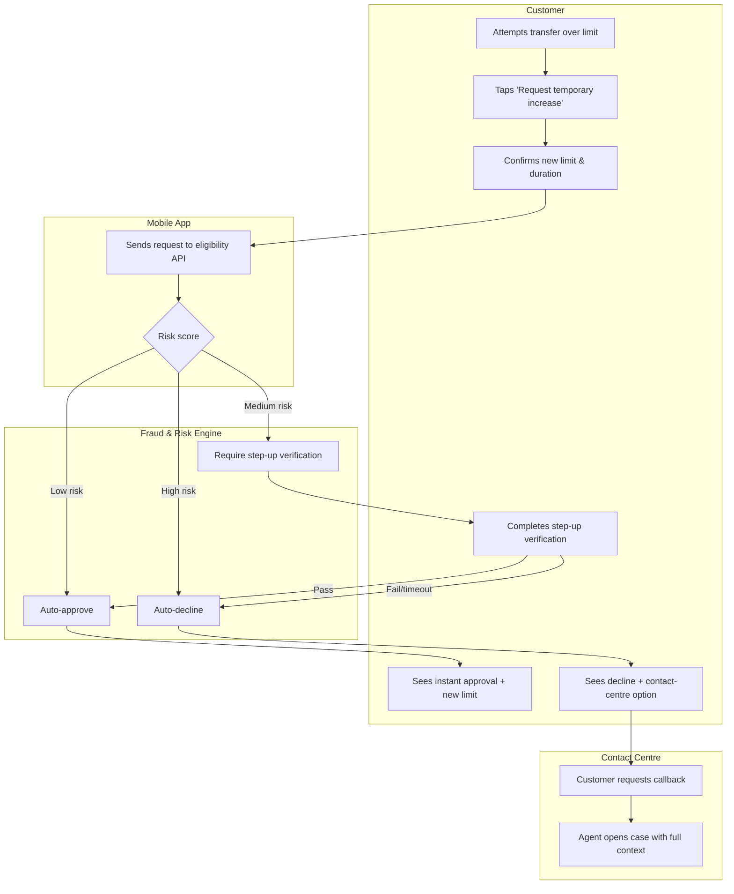

# Business Requirements Document
## Instant e-Transfer Limit Increase — Mobile Banking

| | |
|---|---|
| **Document Status** | Draft for Review |
| **Version** | 1.0 |
| **Author** | Hansika Mali |
| **Date** | September 2026 |
| **Business Owner** | Digital Banking Product Team (hypothetical) |

---

## 1. Executive Summary
Customers who need to send a large Interac e-Transfer (e.g., for a rent
deposit, tuition, or vehicle down payment) frequently hit their default daily
transfer limit and must call the contact centre or visit a branch to
temporarily raise it. This document defines the business requirements for a
self-serve, in-app flow that lets an eligible customer request a temporary
e-Transfer limit increase directly from the mobile banking app.

## 2. Problem Statement
Today, a customer whose transfer exceeds their limit sees a generic decline
message with no in-app path to resolution. This creates:
- **Customer friction** — the transfer fails at the moment of need, often
  outside contact-centre hours.
- **Unnecessary contact-centre volume** — limit-increase requests are a
  known top-10 call driver for the digital banking support line.
- **Missed self-serve opportunity** — the mobile app already holds enough
  identity and risk signal (device trust, transaction history) to approve
  many of these requests automatically, without agent involvement.

## 3. Business Objectives
| # | Objective | Success Metric |
|---|---|---|
| O1 | Reduce contact-centre calls related to transfer limits | ≥ 25% reduction in "limit increase" call volume within 2 quarters of launch |
| O2 | Increase self-serve resolution rate | ≥ 70% of eligible requests approved instantly, no agent involvement |
| O3 | Maintain fraud/risk exposure at or below current levels | No increase in fraud-loss rate attributable to e-Transfer, measured quarterly |
| O4 | Improve customer satisfaction at point of failure | CSAT on the transfer-decline flow improves by ≥ 15 points |

## 4. Scope

**In scope**
- In-app request flow for a **temporary** (24-hour) e-Transfer limit increase
- Real-time eligibility check using existing risk/fraud rules engine
- Instant approval path for low-risk requests; step-up verification for
  medium-risk requests; hard decline with contact-centre routing for
  high-risk requests
- Push/email notification confirming the new temporary limit and expiry
- Audit log entry for every request (approved, step-up, or declined)

**Out of scope (this release)**
- Permanent limit increases (remains a contact-centre / branch process)
- Business banking accounts (retail only for this release)
- Changes to the underlying fraud rules engine itself — this feature
  **consumes** existing risk decisioning, it does not modify it

## 5. Stakeholders
| Role | Interest |
|---|---|
| Digital Banking Product Owner | Feature scope, prioritization, launch decision |
| Fraud & Risk team | Approves eligibility rules and risk thresholds used by the flow |
| Contact Centre Operations | Needs the "decline → route to agent" path to carry full context, so customers aren't asked to repeat themselves |
| Mobile Engineering | Builds the in-app flow and API integration |
| Compliance | Confirms the flow meets disclosure requirements for temporary limit changes |
| Customer (end user) | Wants a fast, transparent way to raise their limit without calling in |

## 6. Assumptions & Constraints
- Assumes the existing fraud rules engine can expose a real-time
  eligibility decision via API with acceptable latency (< 2 seconds)
- Assumes customers must be logged in with an active, unlocked profile;
  no support for guest/unauthenticated requests
- Constraint: temporary limit **automatically reverts** after 24 hours with
  no additional customer action required
- Constraint: a customer may only have one active temporary increase at a time

## 7. User Stories & Acceptance Criteria

### US-1 — Request a temporary limit increase
**As a** mobile banking customer
**I want to** request a temporary increase to my e-Transfer limit from the app
**So that** I can complete a large transfer without calling the bank

**Acceptance Criteria**
- **Given** a logged-in customer whose transfer amount exceeds their current
  daily limit,
  **When** they attempt the transfer,
  **Then** the app offers a "Request a temporary limit increase" option
  instead of only showing a decline message.
- **Given** the customer selects that option,
  **When** they confirm the requested new limit and duration,
  **Then** the request is sent to the eligibility check in real time.

### US-2 — Instant approval for low-risk requests
**As a** low-risk, established customer
**I want** my limit-increase request approved instantly
**So that** I don't have to wait or contact anyone

**Acceptance Criteria**
- **Given** a request scores as low-risk by the eligibility engine,
  **When** the check completes,
  **Then** the new temporary limit is applied immediately and the original
  transfer can proceed in the same session.
- **Given** the increase is approved,
  **When** it takes effect,
  **Then** the customer receives a push notification confirming the new
  limit and its 24-hour expiry.

### US-3 — Step-up verification for medium-risk requests
**As a** customer whose request scores as medium-risk
**I want to** be asked for additional verification
**So that** I can still complete my request without an automatic decline

**Acceptance Criteria**
- **Given** a request scores as medium-risk,
  **When** the eligibility check completes,
  **Then** the app prompts a step-up verification (e.g., one-time passcode).
- **Given** the customer passes step-up verification,
  **When** verification completes,
  **Then** the request is approved and the temporary limit applied.
- **Given** the customer fails or abandons step-up verification,
  **When** the session times out,
  **Then** the request is declined and no limit change is made.

### US-4 — Decline and route to contact centre for high-risk requests
**As a** customer whose request scores as high-risk
**I want** a clear explanation and an easy path to a human
**So that** I'm not left stuck with no way to complete my transfer

**Acceptance Criteria**
- **Given** a request scores as high-risk,
  **When** the eligibility check completes,
  **Then** the app declines the in-app increase and offers a
  "Call us" / "Request a callback" option.
- **Given** the customer is routed to the contact centre,
  **When** an agent opens the case,
  **Then** the agent sees the full request context (amount, risk score,
  decline reason) without the customer repeating information.

### US-5 — Automatic reversion of temporary limit
**As** the bank
**I want** temporary limit increases to expire automatically
**So that** risk exposure doesn't persist beyond the original need

**Acceptance Criteria**
- **Given** a temporary limit increase was approved,
  **When** 24 hours have elapsed,
  **Then** the account's e-Transfer limit automatically reverts to its
  standard value with no customer action required.
- **Given** the limit has reverted,
  **When** the customer next opens the app,
  **Then** their transfer limit displays correctly as the standard value.

## 8. Non-Functional Requirements
| Category | Requirement |
|---|---|
| Performance | Eligibility decision returned in < 2 seconds for 95% of requests |
| Availability | Feature available whenever core mobile banking is available (no separate maintenance window) |
| Security | All requests logged with full audit trail; step-up verification uses existing MFA infrastructure |
| Compliance | Temporary limit change and expiry clearly disclosed to the customer in-app and via notification |
| Accessibility | Flow meets WCAG 2.1 AA, consistent with existing mobile banking standards |

## 9. Process Flow (Swimlane Diagram)

## 10. Risks
| Risk | Likelihood | Impact | Mitigation |
|---|---|---|---|
| Fraud rules engine latency exceeds 2s SLA | Medium | High | Load-test against peak transfer volume before launch; fallback to decline-and-route if timeout |
| Customers repeatedly request increases to circumvent limits long-term | Medium | Medium | Cap number of temporary increases per rolling 30-day period; flag pattern to Fraud & Risk |
| Step-up verification abandonment reduces conversion | Low | Medium | Track abandonment rate in analytics; revisit verification method if abandonment is high |

## 11. Glossary
- **e-Transfer** — Interac Electronic Funds Transfer, used to send money between Canadian bank accounts
- **Step-up verification** — an additional identity check (e.g., one-time passcode) triggered when a transaction carries elevated risk
- **Temporary limit increase** — a time-boxed (24-hour) increase to a customer's daily e-Transfer limit
